# Copilot Instructions for napcat-plugin-epic-free

## 目标

为 AI 编程代理提供立即可用的、与本仓库紧密相关的上下文：架构要点、开发/构建流程、约定与关键集成点，便于自动完成改进、修复与小功能。

---

## 一句话概览

这是一个面向 NapCat 的 Epic Games Store 喜加一推送插件（TypeScript，ESM），使用 Vite 打包到 `dist/index.mjs` 作为插件入口；提供免费游戏查询、定时推送、订阅管理等功能，含 WebUI 管理界面。

---

## 功能概览

本插件参考了 [nonebot-plugin-epicfree](https://github.com/FlanChanXwO/nonebot-plugin-epicfree)（MIT License）的设计与实现，可以在 .example\nonebot-plugin-epicfree-main 下面速查。核心功能包括：

| 功能 | 说明 |
|------|------|
| 免费游戏查询 | 调用 Epic Store API 获取当前免费游戏，以合并转发消息格式发送（含封面图、介绍、链接、截止时间） |
| 定时推送 | 按群/私聊粒度订阅每日推送，可自定义推送时间（HH:MM） |
| 订阅管理 | 命令式 订阅/取消订阅/查看状态，群内需管理员权限 |
| 去重推送 | 基于消息内容指纹（MD5 Hash）避免重复推送同一批游戏 |
| 代理支持 | 支持 HTTP/SOCKS5 代理访问 Epic API（中国大陆用户） |
| WebUI 管理 | React 前端面板，可视化管理配置、订阅、状态 |

### 消息指令

| 指令 | 权限 | 说明 |
|------|------|------|
| `epic喜加一` / `喜加一` | 所有用户 | 获取当前 Epic 免费游戏信息 |
| `epic订阅 HH:MM` | 管理员 | 为当前群/私聊开启每日定时推送 |
| `epic取消订阅` | 管理员 | 取消当前群/私聊的推送 |
| `epic订阅状态` | 所有用户 | 查看当前群/私聊的订阅状态和推送时间 |

---

## 架构设计

### 分层架构

```mermaid
block-beta
    columns 3

    block:entry:3
        A["index.ts (入口)\n生命周期钩子 + 定时任务加载 + WebUI 路由注册 + 事件分发"]
    end

    space:3

    block:middle:3
        columns 3
        B["Handlers\n消息命令处理"]
        C["Services\nEpic API / 定时任务 / 订阅管理"]
        D["WebUI\n前端管理界面"]
    end

    space:3

    block:state:3
        E["core/state\n全局状态单例 + 配置持久化"]
    end

    A --> B
    A --> C
    A --> D
    B --> E
    C --> E

    style entry fill:#e8f4f8,stroke:#2196F3
    style middle fill:#e8f5e9,stroke:#4CAF50
    style state fill:#fff3e0,stroke:#FF9800
```



### 核心设计模式

| 模式 | 实现位置 | 说明 |
|------|----------|------|
| 单例状态 | `src/core/state.ts` | `pluginState` 全局单例，持有 ctx、config 引用 |
| 服务分层 | `src/services/*.ts` | Epic API 调用、定时任务管理、订阅持久化 |
| 配置校验 | `sanitizeConfig()` | 类型安全的运行时配置验证 |
| 内容去重 | 推送历史指纹 | MD5 Hash 比对，避免重复推送同一批游戏 |
| 定时调度 | `setInterval` / 定时器管理 | 按订阅配置执行每日推送，`plugin_cleanup` 时清理 |

---

## 关键文件与职责

### 入口与生命周期

| 文件 | 职责 |
|------|------|
| `src/index.ts` | 插件入口：导出生命周期钩子、加载定时推送任务、注册路由、事件分发 |
| `src/config.ts` | 默认配置 `DEFAULT_CONFIG` 和 WebUI 配置 Schema（含代理配置项） |

### 核心状态

| 文件 | 职责 |
|------|------|
| `src/core/state.ts` | 全局状态单例 `pluginState`，管理 ctx 引用、配置持久化、订阅数据、定时器引用 |
| `src/types.ts` | TypeScript 类型定义（`PluginConfig`, `EpicGame`, `Subscription`, `PushHistory`） |

### 业务服务

| 文件 | 职责 |
|------|------|
| `src/services/epic-api.ts` | 调用 Epic Store 促销 API，解析免费游戏数据，构建合并转发消息 |
| `src/services/scheduler.ts` | 定时推送任务管理：添加/移除/加载定时器，执行推送逻辑，去重检查 |
| `src/services/subscription.ts` | 订阅数据持久化：读取/启用/删除订阅，JSON 文件存储 |
| `src/services/api-service.ts` | WebUI API 路由注册（状态、配置、订阅管理接口） |

### 消息处理

| 文件 | 职责 |
|------|------|
| `src/handlers/message-handler.ts` | 消息命令处理：`喜加一` 查询、`epic订阅/取消订阅/订阅状态` 命令、权限检查 |

### 前端 WebUI

| 文件 | 职责 |
|------|------|
| `src/webui/` | React + Vite 前端项目，管理界面用于配置、订阅管理和状态展示 |

---

## 数据流

### Epic 免费游戏查询流程

```mermaid
flowchart LR
    A["用户发送 喜加一"] --> B["message-handler\n命令解析"]
    B --> C["epic-api.ts\n调用 Epic Store API"]
    C --> D["解析 promotionalOffers\n筛选免费游戏"]
    D --> E["构建合并转发消息\n封面图+介绍+链接"]
    E --> F["send_group_forward_msg\n发送到群/私聊"]

    style C fill:#e8f4f8,stroke:#2196F3
    style E fill:#e8f5e9,stroke:#4CAF50
```



### 定时推送流程

```mermaid
flowchart TD
    A["plugin_init"] --> B["加载 scheduler.json\n恢复所有定时任务"]
    B --> C["setInterval 定时器\n每分钟检查"]
    C --> D{"当前时间匹配\n某订阅的推送时间?"}
    D -->|是| E["调用 epic-api.ts\n获取免费游戏"]
    E --> F{"内容指纹对比\npush_history.json"}
    F -->|内容变化| G["推送消息到订阅目标"]
    F -->|内容相同| H["跳过推送"]
    D -->|否| C
    G --> I["更新推送历史"]

    style A fill:#fff3e0,stroke:#FF9800
    style F fill:#e8f4f8,stroke:#2196F3
    style G fill:#e8f5e9,stroke:#4CAF50
```



### 数据文件

| 文件 | 位置 | 说明 |
|------|------|------|
| 配置文件 | `ctx.configPath` | 插件配置（代理、权限等），由 NapCat 管理 |
| `scheduler.json` | `ctx.dataPath` | 定时推送任务配置（`{ "epic_group_123456": "30 8" }`） |
| `subscriptions.json` | `ctx.dataPath` | 订阅列表（`{ "群聊": ["123456"], "私聊": ["789"] }`） |
| `push_history.json` | `ctx.dataPath` | 推送历史指纹（`{ "epic_group_123456": "md5hash" }`），用于去重 |

---

## 插件生命周期

```mermaid
flowchart TD
    A["NapCat 启动"] --> B["扫描 plugins 目录"]
    B --> C["加载插件模块"]
    C --> D["调用 plugin_init(ctx)\n初始化：加载配置、恢复定时任务、注册路由"]
    D --> E["开始监听消息/事件"]
    E --> F["plugin_onmessage(ctx, event)\n处理 喜加一/订阅/取消订阅 等命令"]
    E --> G["定时器触发\n执行推送任务"]
    F --> E
    G --> E
    D --> H["插件卸载/重载时"]
    H --> I["plugin_cleanup(ctx)\n清理：停止所有定时器、保存配置"]

    style A fill:#e8f4f8,stroke:#2196F3
    style D fill:#fff3e0,stroke:#FF9800
    style F fill:#e8f5e9,stroke:#4CAF50
    style G fill:#e8f5e9,stroke:#4CAF50
    style I fill:#ffebee,stroke:#f44336
```



### 生命周期函数一览

| 函数名 | 是否必选 | 说明 |
|--------|---------|------|
| `plugin_init` | 必选 | 加载配置、恢复定时推送任务、注册 WebUI 路由 |
| `plugin_onmessage` | 必选 | 处理喜加一查询、订阅管理、权限检查 |
| `plugin_cleanup` | 必选 | 清理所有定时器、保存配置和订阅数据 |
| `plugin_config_ui` | 可选 | 导出配置 Schema，用于 WebUI 生成配置面板 |
| `plugin_get_config` | 可选 | 自定义配置读取 |
| `plugin_set_config` | 可选 | 自定义配置保存 |
| `plugin_on_config_change` | 可选 | 配置变更回调（reactive 字段变化时触发） |
| `plugin_config_controller` | 可选 | 配置 UI 控制器，运行时动态控制配置界面 |

---

## NapCatPluginContext 核心属性

`ctx` 是插件与 NapCat 交互的核心桥梁：

| 属性 | 类型 | 说明 |
|------|------|------|
| `ctx.actions` | `ActionMap` | OneBot11 Action 调用器（最常用） |
| `ctx.logger` | `PluginLogger` | 日志记录器（自动带插件名前缀） |
| `ctx.router` | `PluginRouterRegistry` | 路由注册器（API、页面、静态文件） |
| `ctx.pluginName` | `string` | 当前插件名称 |
| `ctx.pluginPath` | `string` | 插件所在目录路径 |
| `ctx.configPath` | `string` | 插件配置文件路径 |
| `ctx.dataPath` | `string` | 插件数据存储目录路径 |
| `ctx.NapCatConfig` | `NapCatConfigClass` | 配置构建工具类 |
| `ctx.adapterName` | `string` | 适配器名称 |
| `ctx.pluginManager` | `IPluginManager` | 插件管理器 |
| `ctx.core` | `NapCatCore` | NapCat 底层核心实例（高级用法） |
| `ctx.oneBot` | `NapCatOneBot11Adapter` | OneBot11 适配器实例（高级用法） |
| `ctx.getPluginExports` | `<T>(id) => T` | 获取其他插件的导出对象 |

---

## 开发流程

### 环境准备

```bash
# 安装依赖
pnpm install

# 类型检查
pnpm run typecheck

# 完整构建（前端 + 后端 + 资源复制）
pnpm run build
# 输出: dist/index.mjs + dist/package.json + dist/webui/

# WebUI 前端开发服务器
pnpm run dev:webui
```

---

## 热重载开发说明

本模板已集成热重载开发能力，极大提升插件开发效率。依赖 Vite 插件 `napcatHmrPlugin`（已在 `vite.config.ts` 配置），需配合 NapCat 端安装并启用 `napcat-plugin-debug` 插件。

### 常用命令

```bash
# 一键部署：构建 → 自动复制到远程插件目录 → 自动重载
pnpm run deploy

# 开发模式：watch 构建 + 每次构建后自动部署 + 热重载（单进程）
pnpm run dev
```

> `deploy` = `vite build`（构建完成时 Vite 插件自动部署+重载）  
> `dev` = `vite build --watch`（每次重新构建后 Vite 插件自动部署+重载）

### 配置说明

`vite.config.ts` 中的 `napcatHmrPlugin()` 会在每次 `writeBundle` 时自动：连接调试服务 → 获取远程插件目录 → 复制 dist/ → 调用 reloadPlugin。

如需自定义调试服务地址或 token：

```typescript
// vite.config.ts
napcatHmrPlugin({
    wsUrl: 'ws://192.168.1.100:8998',
    token: 'mySecret',
})
```

### CLI 交互模式（可选）

```bash
# 独立运行 CLI，进入交互模式（REPL）
npx napcat-debug

# 交互命令
debug> list              # 列出所有插件
debug> deploy            # 部署当前目录插件
debug> reload <id>       # 重载指定插件
debug> status            # 查看服务状态
```

---

### CI/CD

- `.github/workflows/release.yml`：推送 `v*` tag 自动构建并创建 GitHub Release
- `.github/workflows/update-index.yml`：Release 发布后自动 fork 索引仓库、更新 `plugins.v4.json`，通过 `push-to-fork` 向官方索引仓库提交 PR（需配置 `INDEX_PAT` Secret）
- 构建产物由 `vite.config.ts` 中的 `copyAssetsPlugin` 自动处理

---

## 编码约定

### ESM 模块规范

- `package.json` 中 `type: "module"`
- Vite 打包输出为 `dist/index.mjs`

### 类型导入

使用 `napcat-types` 包的深路径导入：

```typescript
import type { NapCatPluginContext, PluginModule, PluginConfigSchema } from 'napcat-types/napcat-onebot/network/plugin/types';
import type { OB11Message, OB11PostSendMsg } from 'napcat-types/napcat-onebot';
import { EventType } from 'napcat-types/napcat-onebot/event/index';
```

### 状态访问模式

```typescript
import { pluginState } from '../core/state';

// 通过单例访问配置
const isEnabled = pluginState.config.enabled;

// 通过单例访问日志器（等价于 ctx.logger）
pluginState.logger.info('处理消息');

// 通过单例访问上下文
const ctx = pluginState.ctx;
```

### OneBot Action 调用

统一使用 `ctx.actions.call()` 四参数模式：

```typescript
// 发送消息
const params: OB11PostSendMsg = {
    message: 'Hello',
    message_type: 'group',
    group_id: '123456',
};
await ctx.actions.call('send_msg', params, ctx.adapterName, ctx.pluginManager.config);

// 无参数 Action
await ctx.actions.call('get_login_info', void 0, ctx.adapterName, ctx.pluginManager.config);
```

### API 响应格式

```typescript
// 成功
res.json({ code: 0, data: { ... } });

// 错误
res.status(500).json({ code: -1, message: '错误描述' });
```

### 事件类型判断

```typescript
import { EventType } from 'napcat-types/napcat-onebot/event/index';

// 在 plugin_onmessage 中过滤非消息事件
if (event.post_type !== EventType.MESSAGE) return;
```

### 路由注册

```typescript
// 需要鉴权的 API → /api/Plugin/ext/<plugin-id>/
ctx.router.get('/endpoint', handler);
ctx.router.post('/endpoint', handler);

// 无需鉴权的 API → /plugin/<plugin-id>/api/
ctx.router.getNoAuth('/endpoint', handler);
ctx.router.postNoAuth('/endpoint', handler);

// 静态文件 → /plugin/<plugin-id>/files/<urlPath>/
ctx.router.static('/static', 'webui');

// 页面注册 → /plugin/<plugin-id>/page/<path>
ctx.router.page({ path: 'dashboard', title: '面板', htmlFile: 'webui/index.html' });

// 内存静态文件 → /plugin/<plugin-id>/mem/<urlPath>/
ctx.router.staticOnMem('/dynamic', [{ path: '/config.json', content: '{}', contentType: 'application/json' }]);
```

### 配置 Schema 构建

```typescript
// 使用 ctx.NapCatConfig 构建器
const schema = ctx.NapCatConfig.combine(
    ctx.NapCatConfig.boolean('enabled', '启用', true, '描述'),
    ctx.NapCatConfig.text('key', '标签', '默认值', '描述'),
    ctx.NapCatConfig.number('count', '数量', 10, '描述'),
    ctx.NapCatConfig.select('mode', '模式', [
        { label: '选项A', value: 'a' },
        { label: '选项B', value: 'b' }
    ], 'a'),
    ctx.NapCatConfig.multiSelect('features', '功能', [...], []),
    ctx.NapCatConfig.html('<p>说明</p>'),
    ctx.NapCatConfig.plainText('纯文本说明'),
);
```

---

## 注意事项

- **日志**：统一使用 `ctx.logger` 或 `pluginState.logger`，提供 `log/debug/info/warn/error` 方法
- **配置持久化**：通过 `pluginState.updateConfig()` / `pluginState.replaceConfig()` 保存
- **群配置**：使用 `pluginState.isGroupEnabled(groupId)` 检查
- **资源清理**：在 `plugin_cleanup` 中必须清理定时器、关闭连接，否则会导致内存泄漏
- **数据存储**：使用 `ctx.dataPath` 获取插件专属数据目录
- **插件间通信**：使用 `ctx.getPluginExports<T>(pluginId)` 获取其他插件的导出

### 图标与表情约定

- **禁止使用 emoji**：代码中不要使用 Unicode emoji 字符（如 `📁`、`🚀`、`✅` 等）
- **后端日志**：如需要输出装饰性字符，使用颜文字（kaomoji），例如：
  ```typescript
  ctx.logger.info('(｡･ω･｡) 插件初始化完成');
  ctx.logger.warn('(；′⌒`) 配置项缺失，使用默认值');
  ctx.logger.error('(╥﹏╥) 连接失败');
  ```
- **前端图标**：使用 SVG 图标，不要使用 emoji。推荐方式：
  - 将 SVG 封装为 React 组件（参考 `src/webui/src/components/icons.tsx`）
  - 或使用 inline SVG `<svg>` 标签
  ```tsx
  // 正确：SVG 图标组件
  export const CheckIcon = () => (
      <svg xmlns="http://www.w3.org/2000/svg" viewBox="0 0 24 24" fill="currentColor" width="16" height="16">
          <path d="M9 16.17L4.83 12l-1.42 1.41L9 19 21 7l-1.41-1.41z" />
      </svg>
  );

  // 错误：使用 emoji
  // <span>✅</span>
  ```

---

## API 查阅方式

- **使用 AI 查询**：`.vscode/mcp.json` 中已预配置 [napcat.apifox.cn](https://napcat.apifox.cn/) 的 MCP 服务器，可在 Copilot Chat 中自然语言查询 OneBot API
- **手动查阅**：访问 https://napcat.apifox.cn/
- **开发文档**：参考 `.example/plugin/` 目录下的完整开发文档

---

## 发布流程

1. 修改 `package.json` 中的 `name`（必须以 `napcat-plugin-` 开头）、`plugin`（显示名称）、`description`、`author` 等字段
2. 配置仓库 Secret `INDEX_PAT`（GitHub PAT，需 `public_repo` 权限）
3. 推送 `v*` tag 触发自动发布：
   ```bash
   git tag v1.0.0
   git push origin v1.0.0
   ```
4. CI 自动构建 → 创建 Release → 向索引仓库提交 PR
